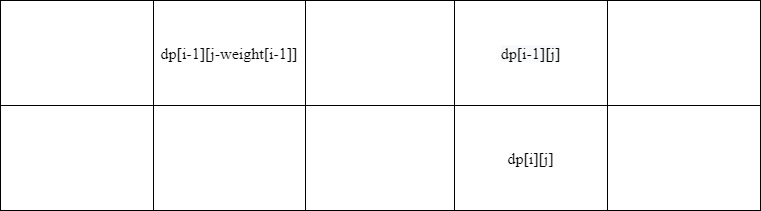

# 如何解决背包问题

- [经典背包问题](#经典)


- [三维背包问题](#三维)


- [如何将问题转换为背包问题](#转换)


- [背包问题的降维](#降维) 


- [完全背包问题](#完全背包)


- [多重背包问题](#多重背包)


### <a name='经典'>经典背包问题</a>
  >有一个容量为target的背包，现有n个物体，weight[i]表示第i个物体的重量,value[i]表示第i个物体的价值，求背包能装的最大价值物体。
  
  动态规划，dp[i][j]表示在前i个当中**任意取**，放入容量为j的背包里的最大价值。
  
  状态方程dp[i][j]=max(dp[i-1][j],dp[i-1][j-weight[i-1]]+value[i-1])
  
  注意边界条件dp[0][0]的值,不同问题值可能不同
```java
class solution{
  public int MaxValue(int []weight,int []value,int target){
    int n=weight.length;
    int [][]dp=new int[n+1][target+1];
    //i取1，因为dp[i]表示前i个，对应的weight,value的下标为i-1
    for(int i=1;i<=n;i++){
      for(int j=0;j<=target;j++){
        dp[i][j]=dp[i-1][j];
        if(j>weight(i-1)){
          dp[i][j]=Math.max(dp[i][j],dp[i-1][j-weight[i-1]]+value[i-1]);
        }
      }
    }
    return dp[n][target];
  }
}
```

### <a name='三维'>三维背包问题</a>
  >在经典背包问题中，只要满足剩余的背包容量大于weight[i]就可以将它装入，而三维背包问题则是在二维的基础上再加了一个限制条件，例如
要求装入背包的物体value总价值>=3，求满足这两个条件的方案数。再加上物体个数就相当于有了三个变量。

  dp[i][j][k]即在前i个物体任取物体,放入容量为j的背包,总价值value>=k的方案数
  
  状态方程：dp[i][j][k]=dp[i-1][j-weight[i-1]][max(0,k-value[i-1]]
  
  边界条件 dp[0][0][0]=1
  
```java
class Solution{
  public int numAns(int minvalue,int []weight,int value[],int target){
    int n=weight.length;
    int [][][]dp=new int[n+1][target+1][minvalue+1];
    dp[0][0][0]=1;
    for(int i=1;i<=n;i++){
      for(int j=0;j<=target;j++){
        for(int k=0;k<=minvalue;k++){
          dp[i][j][k]=dp[i-1][j][k];
          if(j>=weight[i-1]){
            dp[i][j][k]+=dp[i-1][j-weight[i-1]][max(0,k-value[i-1]];
          }
        }
      }
    }
    int sum=0;
    for(int i=0;i<=target;i++){
      sum+=dp[n][i][minvalue];
    }
    return sum;
  }
}
```


### <a name='转换'>如何将问题转换为背包问题</a>
>1.要具有限制条件，如背包的总容量是固定的，这样才能转换为背包问题。

>2.找变量，变量个数决定维度

>3.一般来说，直接变量物体个数为第一维，限制条件为第二维。

>4.分析问题要求的是什么，这决定着边界条件

### <a name='降维'>背包问题的降维</a>
  >背包问题的降维其实也是对背包问题的解进行优化，其中优化主要是对空间复杂度进行优化。优化方式主要是对
  >直接变量进行优化，因为直接变量往往至于上一个变量相关，即dp[i]只与dp[i-1]相关，所有可以对该维度进行优化

> 1.滑动窗口：设置一下大小为2的滑动窗口，这样就只用保存i和i-1对应的变量。即int [][][]dp=new int [2][n+1][m+1];
> <br/>循环的次数是不变的，只是将循环变量对应于滑动窗口的0,1为，做法是:
```java
  for(int i=1;i<n;i++){
    for(int j=0;j<n;j++){
      dp[i&1][j]=dp[(i-1)&1][j];
    }
  }
```
>2.直接去掉该维度：即 int [][]dp=new int[n+1][m+1];然后将后面的维度逆序循环。



> <br/>逆序的原因是，因为dp[i]对dp[i-1]有依赖，而去掉该维度后，如果继续正序循环,如图所示，那么就是dp[i]对dp[i]的依赖，如果逆序循环的话，那么就会先遍历
> 最后一位，这样相当于数组先存放dp[0]，然后从右至左进行更新。


### <a name='完全背包'>完全背包</a>
>&emsp;&emsp;完全背包是指weight[i]对应的物体个数是无限的，状态方程为dp[i][j]=max(dp[i-1][j],dp[i-1][j-k\*weight(i-1)]+k\*value[i-1];
> 相当于增加了循环维度，范围是0<=k\*value[i-1]<=j;
> <br/>&emsp;&emsp;优化方法是降维，然后正序循环。
> <br/>&emsp;&emsp;正序循环的原因是状态转换方程可以转换为dp[i][j]=max(dp[i-1][j],dp[i][j-weight(i-1)]+value[i-1]),所dp[i][j]只依赖于自己和同行左侧的值，所以只需要顺序更新就行。


### <a name='多重背包'>多重背包</a>

>&emsp;&emsp;多重背包是指weight[i]对应对物体个数是有限的，由数组nums[i]记录,可以理解为k多了一个限制条件k<=nums[i],状态方程和完全背包一致
><br/>优化方法：
><br/>1.降维,dp维度逆序循环，但还是要内嵌一个循环判断k;
><br/>2.二进制优化，先扁平化，即先将多重背包转换为0/1背包，然后
